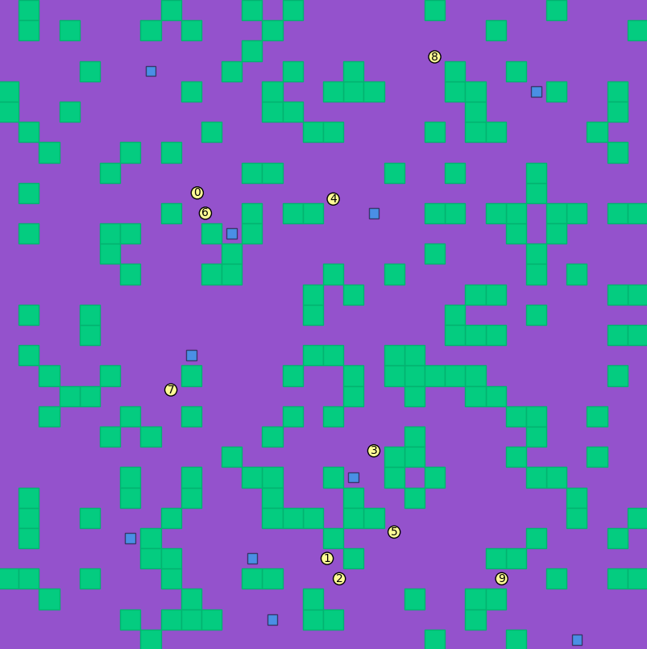
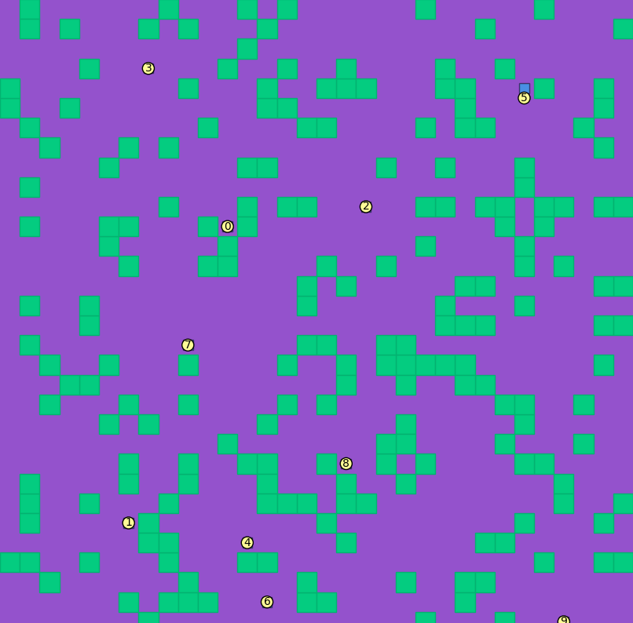

## Alunos
|Matrícula | Aluno |
| -- | -- |
| 15/01499948  |  Thiago Ferreira |
| 17/0062686  |  Pedro Rodrigues Pereira |
| 17/0008371  |  Daniel de Sousa Oliveira Melo Veras |

## Sobre 
O Projeto visa representar um simulador de colisões onde cada agente da colisão possui um ponto inicial e um objetivo. A aplicação é capaz de calcular um caminho para cada agente e replanejá-lo de acordo com os obstáculos e acontecimentos.

## Screenshots

### 1. Agentes em ação


### 2. Momento de chegada nos objetivos.



## Instalação 
**Linguagens**: Python<br>
**Tecnologias**: Numpy, Matplotlib, Scipy<br>

### Intalação das dependências

Basta rodar o comando a seguir na raiz do projeto:

```
$ pip3 install -r requirements.txt
```

## Uso

Feito a instalação das dependências, é necessário rodar os seguintes comandos:


* O Seguinte comando executa todo o algoritmo de **A search**, para calcular o caminho entre cada agente e seu objetivo.

```
$ python3 cbs.py input.yaml output.yaml
```

* O proxímo comando permite a visualização gráfica do tabuleiro e o movimento dos agentes.
```
$ python3 visualize.py input.yaml output.yaml
```

## Vídeo
Adicione 1 ou mais vídeos com a execução do projeto.

## Outros 
Iniciamos o projeto com a ideia de simular casos de acidente, e como os agentes se comportariam. Usando o algorítmo de **A Search**, tivemos como simular um caminho válido para o agente percorrer. Iniciamos a simulação com um tabuleiro inicial de 4x4 e avançamos para um tabuleiro 8x8 até chegar aos 32x32.